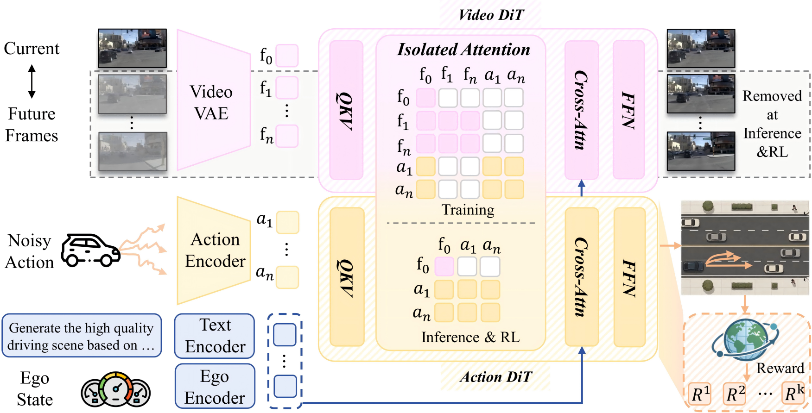
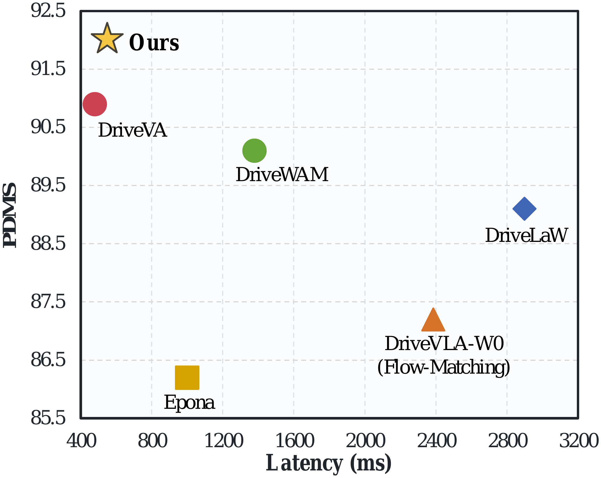
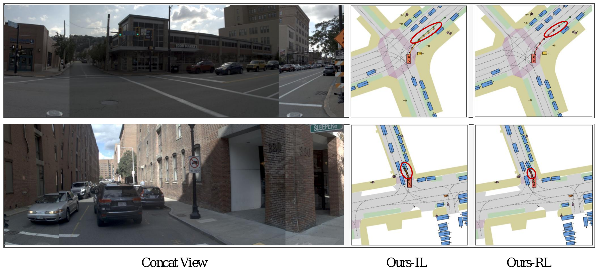

# SimWAM: A Simple World Action Model for End-to-End Autonomous Driving

<div align="center">
  <a href="https://arxiv.org/abs/2608.07468"></a>
  <!-- <a href=""></a> -->
  <a href="https://github.com/H-EmbodVis/SimWAM"></a>
  <a href="https://huggingface.co/H-EmbodVis/SimWAM"></a>
  <a href="LICENSE"></a>

  <h4><em>Zongchuang Zhao<sup>1</sup>, Xin Zhou<sup>1</sup>, Tianyang Xu<sup>1</sup>, Zhengyang Sun<sup>1</sup>, Kaixuan Zhou<sup>2</sup>, Honglin Li<sup>2</sup>, <a href="https://dk-liang.github.io/">Dingkang Liang</a><sup>1&dagger;</sup>, <a href="https://scholar.google.com/citations?user=UeltiQ4AAAAJ&hl=en&oi=ao">Xiang Bai</a><sup>1</sup></em></h4>

  <sup>1</sup> Huazhong University of Science &amp; Technology<br>
  <sup>2</sup> Dongfeng Research &amp; Development Institute<br>
  <sup>&dagger;</sup> Project leader.
</div>

This repository provides the official implementation of **SimWAM** for the paper **A Simple World Action Model for End-to-End Autonomous Driving**, including supervised training and action-only reinforcement learning on NAVSIM.


---

## 📣 News

- `2026.08.19`: Released the SimWAM code and weight on the PhysicalAI-AV dataset.
- `2026.08.07`: Released the SimWAM [paper](https://arxiv.org/abs/2608.07468), code and [weight](https://huggingface.co/H-EmbodVis/SimWAM).

---

## 📄 Abstract

In autonomous driving, World-Action Models (WAMs) have improved end-to-end planning by transferring video dynamics priors to action prediction, but many still couple planning with future-video generation at inference, incurring substantial computational overhead. We present **SimWAM**, a simple yet effective WAM that leverages future-video prediction solely as a training-time supervision signal. It co-trains a pretrained video expert and a lightweight action expert with joint flow matching. An isolated attention mask keeps action prediction independent of future frames, allowing trajectory prediction without future-frame generation at inference. This design supports multiple pretrained video backbones and independent action-expert scaling within a shared attention interface, while preserving the joint learning objective. Moreover, we apply reinforcement learning to optimize a compositional driving reward beyond trajectory imitation. Experiments show that SimWAM achieves 91.9 PDMS on NAVSIM with a favorable trade-off between accuracy and latency among world-model-based planners, while transferring zero-shot to nuScenes. It also achieves competitive planning accuracy on WOD-E2E and PhysicalAI-Autonomous-Vehicles. These results position SimWAM as a plain yet solid baseline for efficient autonomous driving.

---

## 🔍 Overview

<div align="center">
  <a href="assets/architecture.png">
    
  </a>
  <br>
  <sub><b>Overview of SimWAM.</b> During training, the video and action DiTs are jointly optimized for future-frame generation and trajectory prediction via shared attention, while the isolated mask prevents the action tokens from accessing future-frame tokens. During inference and reinforcement learning, the model directly predicts trajectories without explicitly predicting future frames.</sub>
</div>

- **Joint flow-matching co-training.** The video expert &mdash; a video Diffusion Transformer initialized from Wan2.2-5B together with its video VAE and T5 text encoder &mdash; and a lightweight action DiT (hidden size 1024) are co-trained with joint flow matching over future-frame latents and trajectories. Future-video prediction serves as a training-time supervision signal that transfers a traffic-aware dynamics prior into the shared observation representation used for planning.
- **Isolated attention mask.** Future-frame tokens and action tokens both attend to the current observation latents while remaining mutually invisible, keeping action prediction independent of future frames. This mask is the only structural modification required to isolate the action tokens from future-frame information.
- **Direct trajectory prediction at inference.** Because the action expert never depends on future-frame tokens, explicit future-frame generation is omitted at deployment: the standalone action DiT directly predicts trajectories without auxiliary motion modules, substantially reducing inference latency.
- **Reinforcement learning.** The deterministic flow ODE is reformulated as a marginal-preserving SDE, and a group of candidate trajectories per scenario is optimized with FlowGRPO against the compositional NAVSIM PDM reward. RL focuses on the hard `navtrain` scenarios with the lowest PDMS after imitation learning and updates only the LoRA adapters of the action expert. The same recipe transfers to the Waymo Open Dataset E2E benchmark with the official Rater Feedback Score as the reward.
- **Flexibility.** The two experts share no weights and interact only through the unified attention interface: the video backbone is replaceable (e.g., LTX-Video, Wan2.1-1.3B, Cosmos2.5, Wan2.2-5B) and the action expert is independently scalable (0.21B&ndash;1.02B) without modifying the learning objective or inference pipeline.

---

## 📈 Performance

<div align="center">
  <a href="assets/pdms-latency.png">
    
  </a>
  <br>
  <sub><b>SimWAM achieves the best PDMS among world-model-based planners, with a favorable trade-off between accuracy and latency on one A100 GPU.</b></sub>
</div>

### NAVSIM `navtest`

Using only a single front camera at 384&times;672, SimWAM establishes a new state of the art on NAVSIM `navtest`, surpassing the strongest VLM-based planner SGDrive by 0.8 points and ExploreVLA, which explicitly incorporates future image prediction, by 1.5 points. It further outperforms the imagine-then-act WAMs DriveLaW and DriveVA by 2.8 and 1.0 points, respectively. Moreover, the co-trained video expert achieves the lowest FVD of 36.3, compared with 53.6 for the next-best method.

| Method | Reference | Sensors | NC&uarr; | DAC&uarr; | EP&uarr; | TTC&uarr; | C&uarr; | PDMS&uarr; |
| --- | :---: | :---: | :---: | :---: | :---: | :---: | :---: | :---: |
| Human Agent | - | - | 100.0 | 100.0 | 87.5 | 100.0 | 99.9 | 94.8 |
| *Traditional E2E planners* | | | | | | | | |
| UniAD | CVPR'23 | 6&times;C | 97.8 | 91.9 | 78.8 | 92.9 | 100.0 | 83.4 |
| TransFuser | TPAMI'22 | 3&times;C+L | 97.7 | 92.8 | 79.2 | 92.8 | 100.0 | 84.0 |
| DiffusionDrive | CVPR'25 | 3&times;C+L | 98.2 | 96.2 | 82.2 | 94.7 | 100.0 | 88.1 |
| WoTE | ICCV'25 | 3&times;C+L | 98.5 | 96.8 | 81.9 | 94.9 | 99.9 | 88.3 |
| SeerDrive | NeurIPS'25 | 3&times;C+L | 98.4 | 97.0 | 83.2 | 94.9 | 99.9 | 88.9 |
| *VLM-based planners* | | | | | | | | |
| AutoVLA | NeurIPS'25 | 3&times;C | 98.4 | 95.6 | 81.9 | 98.0 | 99.9 | 89.1 |
| ReCogDrive | ICLR'26 | 1&times;C | 97.9 | 97.3 | **87.3** | 94.9 | 100.0 | 90.8 |
| DriveVLA-W0 (Flow-Matching) | ICLR'26 | 1&times;C | 98.4 | 95.3 | 80.9 | 95.2 | 100.0 | 87.2 |
| DriveVLA-W0 (Query-Base) | ICLR'26 | 1&times;C | 98.7 | **99.1** | 83.3 | 95.3 | 99.3 | 90.2 |
| ExploreVLA | ECCV'26 | 1&times;C | 98.8 | 98.4 | 83.5 | 96.5 | 99.9 | 90.4 |
| SGDrive | CVPR'26 | 1&times;C | 98.6 | 97.8 | 85.8 | 96.2 | 100.0 | 91.1 |
| *World-model-based planners* | | | | | | | | |
| Epona | ICCV'25 | 1&times;C | 97.9 | 95.1 | 80.4 | 93.8 | 99.9 | 86.2 |
| PWM | NeurIPS'25 | 1&times;C | 98.6 | 95.9 | 81.8 | 95.4 | 100.0 | 88.1 |
| DriveLaW | CVPR'26 | 1&times;C | 99.0 | 97.1 | 81.3 | 96.7 | 100.0 | 89.1 |
| DriveVA | ECCV'26 | 1&times;C | **99.2** | 97.5 | 83.5 | **98.7** | 100.0 | 90.9 |
| DriveWAM | arXiv'26 | 1&times;C | 98.3 | 98.1 | 84.3 | 95.2 | 100.0 | 90.1 |
| **SimWAM (Ours)** | - | 1&times;C | 98.5 | 99.1 | 86.5 | 96.1 | 99.8 | **91.9** |

### Future-video generation quality

All methods use a 4 s horizon at 2 Hz on `navtest`.

| Metric | SVD | DrivingGPT | Uni-World VLA | PWM | ForgeDrive | DriveDreamer-Policy | **SimWAM (Ours)** |
| --- | :---: | :---: | :---: | :---: | :---: | :---: | :---: |
| FVD&darr; | 227.5 | 142.6 | 141.8 | 86.0 | 69.2 | 53.6 | **36.3** |

### Component analysis

Video-expert fine-tuning, future-video supervision, and reinforcement learning contribute complementary gains, improving PDMS by 5.4 points while preserving the simplicity and efficient inference of the standalone action expert.

| Configuration | NC | DAC | EP | TTC | PDMS |
| --- | :---: | :---: | :---: | :---: | :---: |
| Action expert only | 98.0 | 95.2 | 81.0 | 93.8 | 86.5 |
| + Video expert fine-tuning | 98.2 | 96.8 | 82.6 | 94.5 | 88.4 |
| + Future-video supervision | **98.6** | 98.0 | 84.0 | 95.8 | 90.3 |
| + RL | 98.5 | **99.1** | **86.5** | **96.1** | **91.9** |

### Qualitative results

<div align="center">
  <a href="assets/qualitative.png">
    
  </a>
  <br>
  <sub><b>Qualitative comparison on two <code>navtest</code> scenarios.</b> After reinforcement learning, the ego commits further along the route while staying collision-free within the drivable area.</sub>
</div>

### NAVSIM v2 (`navtest`)

We further evaluate SimWAM on NAVSIM-v2, which adopts a reactive simulation
protocol and the unified EPDMS metric. In addition to the original PDMS terms,
EPDMS considers Driving Direction Compliance (DDC), Traffic Light Compliance
(TLC), Lane Keeping (LK), History Comfort (HC), and Extended Comfort (EC). All
NAVSIM-v2 experiments are conducted without reinforcement learning, where
SimWAM attains the highest EPDMS of 90.2, surpassing DriveLaW by 1.6 points.

| Method | Reference | NC&uarr; | DAC&uarr; | DDC&uarr; | TLC&uarr; | EP&uarr; | TTC&uarr; | LK&uarr; | HC&uarr; | EC&uarr; | EPDMS&uarr; |
| --- | :---: | :---: | :---: | :---: | :---: | :---: | :---: | :---: | :---: | :---: | :---: |
| Human Agent | - | 100.0 | 100.0 | 99.8 | 100.0 | 87.4 | 100.0 | 100.0 | 98.1 | 90.1 | 90.3 |
| *Traditional E2E planners* | | | | | | | | | | | |
| TransFuser | TPAMI'22 | 96.9 | 89.9 | 97.8 | 99.7 | 87.1 | 95.4 | 92.7 | 98.3 | 87.2 | 76.7 |
| DiffusionDrive | CVPR'25 | 98.2 | 95.9 | 99.4 | 99.8 | 87.5 | 97.3 | 96.8 | 98.3 | **87.7** | 84.5 |
| *VLM-based planners* | | | | | | | | | | | |
| ReCogDrive* | ICLR'26 | 98.3 | 95.2 | 99.5 | 99.8 | 87.1 | 97.5 | 96.6 | 98.3 | 86.5 | 83.6 |
| SGDrive | CVPR'26 | 98.6 | 94.3 | 99.5 | **99.9** | 86.0 | 97.9 | 96.1 | 98.3 | 85.9 | 86.2 |
| *World-model-based planners* | | | | | | | | | | | |
| DriveVLA-W0 | ICLR'26 | 98.5 | **99.1** | 98.0 | 99.7 | 86.4 | 98.1 | 93.2 | 97.9 | 58.9 | 86.1 |
| DriveLaW | CVPR'26 | **98.7** | 96.9 | 99.6 | 99.8 | 87.5 | 98.3 | 97.6 | **98.4** | 77.4 | 88.6 |
| **SimWAM (Ours)** | - | 98.6 | 98.0 | **99.7** | **99.9** | 87.5 | **98.4** | **97.9** | 98.3 | 84.4 | **90.2** |

\* indicates training with reinforcement learning.

### NAVSIM v2 (`navhard`)

`navhard` focuses on safety-critical scenarios and follows a two-stage
closed-loop protocol: stage 1 (S1) evaluates the planner on real-world
scenarios, while stage 2 (S2) re-evaluates the corresponding synthesized
scenarios with reactive traffic agents. Even before reinforcement learning,
SimWAM attains the best overall EPDMS of 37.6, surpassing DriveLaW by 7.0
points with leading DAC, DDC, TTC, and LK, especially in the reactive second
stage where surrounding agents respond to the ego vehicle.

| Method | Reference | Stage | NC&uarr; | DAC&uarr; | DDC&uarr; | TLC&uarr; | EP&uarr; | TTC&uarr; | LK&uarr; | HC&uarr; | EC&uarr; | EPDMS&uarr; |
| --- | :---: | :---: | :---: | :---: | :---: | :---: | :---: | :---: | :---: | :---: | :---: | :---: |
| *Traditional E2E planners* | | | | | | | | | | | | |
| TransFuser | TPAMI'22 | S1 | 96.2 | 79.5 | 99.1 | 99.5 | 84.1 | 95.1 | 94.2 | 97.5 | 79.1 | 23.1 |
| | | S2 | 77.7 | 70.2 | 84.2 | 98.0 | 85.1 | 75.6 | 45.4 | 95.7 | **75.9** | |
| DiffusionDrive | CVPR'25 | S1 | 96.8 | 86.0 | 98.8 | 99.3 | 84.0 | 95.8 | 96.7 | 97.6 | **79.6** | 27.5 |
| | | S2 | 80.1 | 72.8 | 84.4 | 98.4 | 85.9 | 76.6 | 46.4 | 96.3 | 72.8 | |
| *VLM-based planners* | | | | | | | | | | | | |
| SGDrive | CVPR'26 | S1 | 95.8 | 87.6 | 97.8 | **99.8** | 84.4 | 94.7 | 92.9 | **97.8** | 28.9 | 25.5 |
| | | S2 | 79.4 | 65.4 | 79.1 | **98.9** | 88.9 | 75.3 | 42.7 | 96.4 | 29.6 | |
| ReCogDrive | ICLR'26 | S1 | 96.4 | 78.9 | 98.7 | **99.8** | 82.6 | 95.6 | 94.4 | 97.6 | 74.2 | 25.7 |
| | | S2 | 80.2 | 65.0 | 82.4 | 98.7 | 85.2 | 76.9 | 43.8 | 96.6 | 71.8 | |
| *World-model-based planners* | | | | | | | | | | | | |
| DriveVLA-W0 | ICLR'26 | S1 | 96.8 | 83.3 | 99.0 | 99.6 | **84.6** | 95.3 | 96.4 | 97.6 | 78.2 | 24.4 |
| | | S2 | 76.8 | 64.3 | 79.9 | 98.3 | **89.2** | 75.0 | 46.8 | 95.8 | 53.1 | |
| DriveLaW | CVPR'26 | S1 | 97.3 | 89.1 | 99.2 | 99.6 | 84.3 | **97.1** | 96.2 | **97.8** | 67.6 | 30.6 |
| | | S2 | **82.5** | 67.6 | 83.5 | 98.1 | 84.8 | 78.5 | 45.8 | 96.4 | 57.3 | |
| **SimWAM (Ours)** | - | S1 | **98.0** | **92.0** | **99.7** | 99.6 | 83.8 | 96.2 | **97.3** | **97.8** | 71.6 | **37.6** |
| | | S2 | 81.8 | **78.6** | **87.3** | 98.4 | 86.3 | **78.6** | **49.5** | 96.3 | 69.9 | |

### Waymo Open Dataset E2E (WOD-E2E)

Open-loop planning on the rater-annotated validation and test splits. ADE
denotes the average displacement error and RFS the official Rater Feedback
Score. Reinforcement learning is performed on the validation split only;
\* indicates the RL-fine-tuned model.

Validation split:

| Method | ADE@3s&darr; | ADE@5s&darr; | RFS&uarr; |
| --- | :---: | :---: | :---: |
| Human Driver | - | - | 8.13 |
| VAD | 3.19 | 5.81 | 4.45 |
| UniAD | 6.50 | 10.81 | 5.78 |
| RAP-DINO | 0.97 | 2.20 | 7.91 |
| SimWAM (Ours) | 0.98 | 2.29 | 7.99 |
| SimWAM (Ours)\* | 0.98 | 2.27 | **8.29** |

Test split:

| Method | ADE@3s&darr; | ADE@5s&darr; | RFS&uarr; |
| --- | :---: | :---: | :---: |
| UniPlan | 1.31 | 2.99 | 7.78 |
| dVLM-AD | 1.29 | 3.02 | 7.63 |
| HMVLM | 1.33 | 3.07 | 7.74 |
| AutoVLA\* | 1.35 | 2.96 | 7.56 |
| NoRD\* | 1.25 | - | 7.71 |
| SimWAM (Ours) | 1.22 | 2.69 | 7.77 |
| SimWAM (Ours)\* | 1.21 | 2.68 | 7.84 |

Although RL is performed on the validation split, the imitation-trained model
alone already surpasses the strongest baseline RAP-DINO there with an RFS of
7.99. On the held-out test split, the imitation-trained model already surpasses
all compared methods in ADE, and RL generalizes to this split as well,
improving RFS from 7.77 to 7.84.

### PhysicalAI-Autonomous-Vehicles

We evaluate on the same 1,000-clip test subset adopted by DriveWAM for a
consistent comparison, reporting Average Displacement Error (ADE) and Final
Displacement Error (FDE) over 3-second and 4-second future trajectories.
Although trained on only 65K samples, SimWAM achieves the best ADE and FDE at
both horizons with the imitation-trained model alone. SV denotes single-view camera.

| Method | Source | Sensors | Params. | ADE@3s&darr; | FDE@3s&darr; | ADE@4s&darr; | FDE@4s&darr; |
| --- | :---: | :---: | :---: | :---: | :---: | :---: | :---: |
| VaVAM* | Valeo | SV | 1.3B | 2.31 | 4.32 | - | - |
| Alpamayo-1.5 | NVIDIA | SV | 10B | 0.80 | 2.31 | 1.44 | 4.18 |
| DriveWAM | - | SV | 5B + 8B | 0.47 | 1.35 | 0.83 | 2.47 |
| **SimWAM (Ours)** | - | SV | 6B | **0.40** | **1.08** | **0.69** | **1.96** |

\* evaluated using the released checkpoint, which only supports up to 3s prediction.

### Zero-shot generalization on nuScenes

The NAVSIM-trained model is evaluated on the nuScenes open-loop planning
benchmark without fine-tuning. \* denotes using only the front camera as input.

| Method | Finetune | Input | Auxiliary Supervision | L2 1s&darr; | L2 2s&darr; | L2 3s&darr; | L2 Avg.&darr; | Coll. 1s&darr; | Coll. 2s&darr; | Coll. 3s&darr; | Coll. Avg.&darr; |
| --- | :---: | :---: | :---: | :---: | :---: | :---: | :---: | :---: | :---: | :---: | :---: |
| ST-P3 | &check; | Camera | Map&Box&Depth | 1.33 | 2.11 | 2.90 | 2.11 | 0.23 | 0.62 | 1.27 | 0.71 |
| UniAD | &check; | Camera | Map&Box&Motion | 0.48 | 0.96 | 1.65 | 1.03 | 0.05 | 0.17 | 0.71 | 0.31 |
| VAD-Base | &check; | Camera | Map&Box&Motion | 0.54 | 1.15 | 1.98 | 1.22 | 0.04 | 0.39 | 1.17 | 0.53 |
| GenAD | &check; | Camera | Map&Box&Motion | 0.36 | 0.83 | 1.55 | 0.91 | 0.06 | 0.23 | 1.00 | 0.43 |
| Epona | &check; | Camera\* | None | 0.61 | 1.17 | 1.98 | 1.25 | 0.01 | 0.22 | 0.85 | 0.36 |
| DriveVA | &cross; | Camera\* | None | 0.33 | **0.76** | **1.43** | **0.84** | 0.00 | 0.07 | 0.12 | 0.06 |
| DriveWAM | &cross; | Camera\* | None | **0.28** | 0.81 | 1.80 | 0.96 | 0.00 | 0.05 | 0.14 | 0.06 |
| **SimWAM (Ours)** | &cross; | Camera\* | None | 0.29 | 0.82 | 1.77 | 0.96 | 0.00 | **0.03** | **0.11** | **0.05** |

Despite using neither nuScenes supervision nor auxiliary annotations, SimWAM
achieves an average L2 error and collision rate comparable to or better than
those of strong zero-shot baselines.

---

## ⚙️ Installation

Clone the repository:

```bash
git clone https://github.com/H-EmbodVis/SimWAM.git
cd SimWAM
```

Create a Python 3.10 environment and install the pinned runtime dependencies:

```bash
conda create -n simwam python=3.10 -y
conda activate simwam

python -m pip install -r requirements.txt
python -m pip install -e navsim --no-deps
python -m pip install -e navsim_v2 --no-deps
python -m pip install -e . --no-deps
```
For NAVSIM, nuPlan, maps, and dataset preparation, follow the
[official NAVSIM v1.1 repository](https://github.com/autonomousvision/navsim/tree/v1.1)
and the [nuPlan devkit](https://github.com/motional/nuplan-devkit). The required
release subset is included under `navsim/`.

All commands are intended to run from the repository root and use relative
paths by default.

---

## 📦 Preparation

### ActionDiT initialization

```bash
bash scripts/model_prepare.sh
```

### Text embeddings

```bash
bash scripts/precomput_text_embed.sh
```

Use `+overwrite=false` to keep existing embeddings.

### Model weights

Download the checkpoints from the
[Hugging Face repository](https://huggingface.co/H-EmbodVis/SimWAM) into `weights/`.
Every RL checkpoint is LoRA-merged, so the evaluation scripts load it without the
LoRA code path.

| File | Dataset | Stage |
| --- | --- | --- |
| `SimWAM.pt` | NAVSIM | supervised (main released checkpoint) |
| `SimWAM-IL-step044400.pt` | NAVSIM | supervised, step 44400 |
| `SimWAM-RL.pt` | NAVSIM | FlowGRPO on the hard `navtrain` subset, step 20000 |
| `SimWAM-PAI-AV.pt` | PhysicalAI-AV | supervised |
| `SimWAM-Waymo-IL.pt` | Waymo E2E | supervised, step 52140 |
| `SimWAM-Waymo-RL.pt` | Waymo E2E | RFS GRPO, step 2400 |

---

## 🏋️ Training and Evaluation

### NAVSIM

#### Supervised training

```bash
NNODES=4 \
NPROC_PER_NODE=8 \
bash scripts/train_navsim_zero1_torchrun.sh \
  task=navsim_uncond_front_384x672_1e-4 \
  num_workers=8
```

#### FlowGRPO LoRA fine-tuning

RL reformulates the deterministic flow ODE as a marginal-preserving SDE, samples a
group of candidate trajectories per scenario, and optimizes only the action
expert's LoRA adapters against the compositional NAVSIM PDM reward. It focuses on
the hard `navtrain` subset whose base-model PDM score is below 0.9, and is
warm-started from the supervised checkpoint.

```bash
NNODES=1 NPROC_PER_NODE=8 bash scripts/train_navsim_grpo_zero1_torchrun.sh \
    task=navsim_grpo_action_pdm_384x672_flowgrpo_lora \
    num_workers=8 \
    output_dir='./runs_grpo/navsim_pdm_below0p9/' \
    data.train.scene_filter="./navsim/navsim/planning/script/config/common/train_test_split/scene_filter/navtrain_pdm_score_below0p9.yaml" \
    grpo.eval.num_batches=8 \
    max_steps=170000 save_every=1000
```

The task preset already selects that scene filter and 8 eval batches, so the
minimal form is equivalent:

```bash
NPROC_PER_NODE=8 bash scripts/train_navsim_grpo_zero1_torchrun.sh \
  task=navsim_grpo_action_pdm_384x672_flowgrpo_lora
```

`configs/task/navsim_grpo_action_pdm_384x672_flowgrpo_lora.yaml` holds the whole
recipe: 384&times;672 front camera, 8 candidates per condition, 10 denoising steps
of which 3 are stochastic, PPO clip 0.005, 4 inner updates per rollout, LoRA r=16
on the action expert's q/k/v/o, and per-dimension KL anchor weights
`[x, y, heading] = [0.2, 1.0, 1.0]`. Shared defaults live in
`configs/train_grpo.yaml`.

The supervised warm start defaults to `./weights/SimWAM.pt`; point
`SIMWAM_IL_CHECKPOINT` or `model.checkpoint_path=...` at your own run to change it.
The launcher requires the PDM metric cache at `data/metric_cache_navtrain`
(override with `NAVSIM_METRIC_CACHE_PATH`).

Saved weights under `checkpoints/weights/` are LoRA-merged, so every evaluation
script consumes them without the LoRA code path. `checkpoints/state/` keeps the
adapters, the frozen IL reference and the optimizer for `resume=`.

#### Evaluation

```bash
CKPT=./runs_grpo/navsim_pdm_below0p9/checkpoints/weights/step_XXXXXX.pt \
TASK=navsim_grpo_action_pdm_384x672_flowgrpo_lora \
NPROC_PER_NODE=8 \
bash experiments/navsim/run_eval_navsim.sh
```

To verify the released supervised checkpoint with a one-sample smoke test:

```bash
CKPT=./weights/SimWAM.pt \
TASK=navsim_uncond_front_384x672_1e-4 \
NPROC_PER_NODE=1 \
bash experiments/navsim/run_eval_navsim.sh \
  EVALUATION.max_samples=1 \
  EVALUATION.num_inference_steps=2 \
  EVALUATION.save_videos=false
```


To evaluate the released reinforcement-learning checkpoint:

```bash
CKPT=./weights/SimWAM-RL.pt \
TASK=navsim_grpo_action_pdm_384x672_flowgrpo_lora \
NPROC_PER_NODE=8 \
bash experiments/navsim/run_eval_navsim.sh
```


Training outputs are written to `runs/`; evaluation outputs are written to
`evaluate_results/navsim/`.

The supplied launchers use DeepSpeed ZeRO-1 through
`scripts/ds_configs/ds_zero1_config.json`. The matching Accelerate configuration
is `scripts/accelerate_configs/accelerate_zero1_ds.yaml`.

### NAVSIM v2 prediction and scoring

The v2 prediction scripts write token-level trajectories for `navtest` or
`navhard_two_stage`; the scoring launcher consumes those `.npy` files with the
v2 PDM evaluator. Set `CKPT`, `EXP_NAME`, and the dataset/cache roots as needed.

```bash
CKPT=./weights/SimWAM.pt EXP_NAME=simwam_v2 \
  bash experiments/navsim/run_predict_navsim_v2.sh

CKPT=./weights/SimWAM.pt EXP_NAME=simwam_navhard \
  bash experiments/navsim/run_predict_navhard.sh

EXP_NAME=simwam_v2 SPLIT=both \
  bash navsim_v2/scripts/evaluation/run_npy_trajectory_agent_pdm_score_evaluation.sh
```

### PhysicalAI

The PhysicalAI data is built from the
[NVIDIA PhysicalAI-Autonomous-Vehicles dataset](https://huggingface.co/datasets/nvidia/PhysicalAI-Autonomous-Vehicles).
The training/test clip splits and data processing follow
[DriveWAM](https://github.com/chenshi3/DriveWAM)
([Hugging Face](https://huggingface.co/chenchenshi/DriveWAM)).

The migrated metadata files are `data/physicalai_train.jsonl` and
`data/physicalai_dataset_stats.json`. Keep the referenced front-camera frames
under `data/physicalai/images/` using the relative paths in the JSONL file.

The PhysicalAI checkpoint and training data are available on our
[Hugging Face repository](https://huggingface.co/H-EmbodVis/SimWAM).

Train and evaluate with:

```bash
NPROC_PER_NODE=2 bash scripts/train_physicalai_zero1_torchrun.sh \
  task=physicalai_uncond_front_384x672_1e-4

CKPT=./weights/SimWAM-PAI-AV.pt NPROC_PER_NODE=1 \
  bash experiments/physicalai/run_eval.sh \
  EVALUATION.max_clips=1 EVALUATION.num_inference_steps=2
```

### Waymo Open Dataset E2E

SimWAM also trains and fine-tunes on the
[Waymo Open Dataset End-to-End Driving](https://github.com/waymo-research/waymo-open-dataset)
benchmark: one FRONT camera at 480&times;512, native 20&times;2 XY actions
(5 s at 4 Hz) and `[vx, vy, ax, ay, command(4)]` proprioception. See
[`experiments/waymo/README.md`](experiments/waymo/README.md) for the full data
layout and every entry point.

The metadata files are `data/waymo_training_front_video4s_traj5s_4hz_xy.jsonl`
(333,537 IL rows), `data/waymo_val_front_current_traj5s_4hz_xy_pref_only.jsonl`
(479 scored-reference rows, used for validation and for RL) and
`data/waymo_test_front_current_input.jsonl` (1,505 label-free test rows), plus
`data/waymo_dataset_stats.json` for action normalization. Keep the camera frames
under `data/waymo/` — every image path in the manifests is **relative** to that
root (override with `WAYMO_DATA_ROOT`), e.g.
`images/training/<scene_id>/FRONT/009.jpg`. The manifests are distributed through
our [Hugging Face repository](https://huggingface.co/H-EmbodVis/SimWAM);
`data/waymo_dataset_stats.json` and the `.summary.json` provenance sidecars are
tracked in the repository.

#### Supervised training and evaluation

```bash
NPROC_PER_NODE=8 bash scripts/train_waymo_zero1_torchrun.sh \
  task=waymo_uncond_front_512x480_1e-4

CKPT=./weights/SimWAM-Waymo-IL.pt NPROC_PER_NODE=8 \
  bash experiments/waymo/run_eval_waymo_action_only.sh
```

Validation runs action-only inference over all 479 scored rows and reports
ADE/FDE at 1/3/5 s and the official Rater Feedback Score.

#### RFS reinforcement learning

The same RL recipe used on NAVSIM, with the vendored **official RFS** as the
reward and per-dimension KL weights `[x, y] = [0.2, 1.0]`:

```bash
NPROC_PER_NODE=8 bash scripts/train_waymo_grpo_zero1_torchrun.sh \
  task=waymo_grpo_rfs num_epochs=10 max_steps=null
```

The recipe, the reward flow and the epoch accounting are documented in
[`experiments/waymo/GRPO.md`](experiments/waymo/GRPO.md).

#### Test-set prediction

```bash
CKPT=./weights/SimWAM-Waymo-RL.pt NPROC_PER_NODE=8 \
  bash experiments/waymo/run_predict_waymo_test.sh
```

`make_test_submission.py` then packages `predictions.jsonl` into the official
binproto shards and `tar.gz`; see
[`experiments/waymo/TEST_SUBMISSION.md`](experiments/waymo/TEST_SUBMISSION.md).

---

## 👍 Acknowledgement

SimWAM builds upon the following projects and resources:

- [NAVSIM](https://github.com/autonomousvision/navsim) for the planning benchmark and evaluation tooling.
- [nuPlan / OpenScene](https://github.com/motional/nuplan-devkit) for the driving datasets.
- [Wan2.2](https://github.com/Wan-Video/Wan2.2) for the pretrained video generation backbone.
- [NVIDIA PhysicalAI-Autonomous-Vehicles](https://huggingface.co/datasets/nvidia/PhysicalAI-Autonomous-Vehicles) for the PhysicalAI driving dataset.
- [DriveWAM](https://github.com/chenshi3/DriveWAM) for the PhysicalAI clip splits and data processing.
- [Waymo Open Dataset](https://github.com/waymo-research/waymo-open-dataset) for the End-to-End Driving benchmark and the official Rater Feedback Score implementation.

---

## 📖 Citation

If SimWAM is useful in your research, please consider citing the paper:

```bibtex
@article{zhao2026simwam,
  title={SimWAM: A Simple World Action Model for End-to-End Autonomous Driving}, 
  author={Zongchuang Zhao and Xin Zhou and Tianyang Xu and Zhengyang Sun and Kaixuan Zhou and Honglin Li and Dingkang Liang and Xiang Bai},
  journal={arXiv preprint arXiv:2608.07468},
  year = {2026}
}
```

---

## License

See [LICENSE](LICENSE). NAVSIM, Wan2.2, nuPlan, OpenScene, and Waymo Open
Dataset retain their own licenses and distribution terms. Refer to the official
[NAVSIM license](https://github.com/autonomousvision/navsim/blob/v1.1/LICENSE),
[Wan2.2 repository](https://github.com/Wan-Video/Wan2.2),
[nuPlan license](https://github.com/motional/nuplan-devkit/blob/master/LICENSE.txt),
and [Waymo Open Dataset license](https://github.com/waymo-research/waymo-open-dataset/blob/master/LICENSE)
for upstream terms.

The vendored Rater Feedback Score implementation under
`src/simwam/datasets/waymo/_vendor/` is an unmodified copy of the Waymo Open
Dataset code and stays under its Apache-2.0 license (see the accompanying
`LICENSE` file in that directory).
